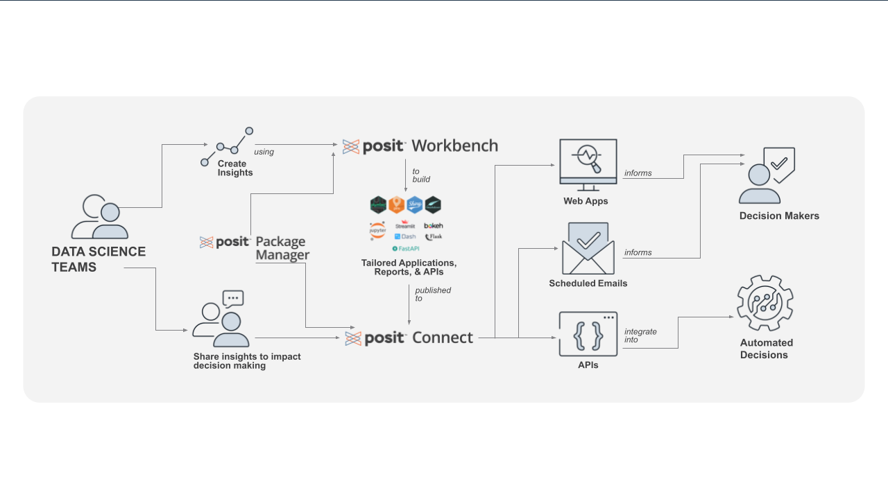

```{r setup, include=FALSE}
knitr::opts_chunk$set(echo = TRUE)
```
<div id="banner">
# Posit for Healthcare and Life Sciences
</div>
<div class="main-div">
## <b>Posit Team Overview</b>
</div>
<div class="main-div">
<b>Posit Team</b> gives your organization access to the leading modular platform for data science. An enterprise license includes unrestricted server deployment of the following tools:
</div>
<div class="main-div">

   - <b>Posit Workbench</b> - Analyze data and create data products using R or Python in the RStudio IDE, Jupyter Notebooks, or JupyterLab.
   - <b>Posit Connect</b> - Easily deploy, schedule, automate, and scale data products with the click of a button, including Shiny apps, R Markdown reports, Jupyter Notebooks, Flask APIs, Dash apps, and more.
   - <b>Posit Package Manager</b> - Control and manage R and Python packages across the enterprise for governance and reproducibility.
</div>
<div class="main-div">

</div>

<div class="tab-set-div">
## Posit License Options {.tabset}

### Enterprise

<div class="sub-main-div">
Posit's Enterprise products are the ideal solution for Life Science and Healthcare organizations. With unlimited server activations, your team can set up high availability, maintain separate staging and production environments, and can leverage multiple server activations for your validated environments. In addition to providing multiple server activations, Posit Connect Enterprise offers full support of R and Python, including applications and APIs. Posit Package Manager Enterprise provides unlimited repositories for robust data science teams that have distinct requirements. 
</div>

### Standard

<div class="sub-main-div">
Posit's Base and Standard products are best suited for smaller organizations building out their data science workflows when scalability, high availability, and environment validation aren't immediate concerns. All Posit Base and Standard products are restricted to a single server activation\*. Posit Connect Base offers support for Shiny apps written in R, RMarkdown, Quarto, and Jupyter products, while Posit Connect Standard offers additional support for Plumber APIs and Python applications. Posit Package Manager Base includes 1 repository and Posit Package Manager Standard 10 repositories.
</div>
<div class="sub-main-div">
\*Posit Package Manager Standard includes an additional high availability server activation and 1 testing server activation.
</div>
</div>
<div class="main-div">
### <b>[Individual Products Page](https://posit.co/pricing/individual-products/)</b>
</div>
<hr>
<div class="main-div">
## <b>Posit Team Demo</b>
</div>
\
<div class="main-div">
<div class="iframe-container" align="center">
<iframe class="responsive-frame" src="https://www.youtube.com/embed/VrF9EdgiSy8" allowfullscreen data-external="1"></iframe>
</div>
</div>
\
\
\
<div class="tab-set-div">
## Life Science and Healthcare Specific {.tabset}

### Life Science and Healthcare Resources

<div class="sub-main-div">
   - [Posit in Life Sciences](https://www.rstudio.com/solutions/pharma/)

   - [A Guidance Document for the Use of Posit Professional Products in Regulated Clinical Trial Environments](https://www.rstudio.com/wp-content/uploads/2019/06/rstudio_compliance_validation.pdf)

   - [How do I select an R package for my clinical workflow?](https://www.lexjansen.com/phuse-us/2019/tt/TT11.pdf)

   - [R/Pharma Conference](https://rinpharma.com/)

   - [R Validation Hub](https://www.pharmar.org/)
</div>

### Customer Webinars and Stories

<div class="sub-main-div">
   - [Scaling Data Science with R at Janssen Pharmaceuticals](https://rstudio.com/resources/webinars/scaling-data-science-with-r-at-janssen-pharmaceuticals/)

   - [How GSK is Using R to Drive Agility in Clinical Reporting](https://rstudio.com/resources/webinars/using-r-to-drive-agility-in-clinical-reporting/)

   - [How California Uses Shiny in Production to fight Covid-19 (California Dept. of Public Health)](https://blog.rstudio.com/2020/11/19/using-shiny-in-production-to-monitor-covid-19/)

   - [Shiny New Things Using R To Bridge the Gap in Electronic Medical Reporting - Brandon Graham (Children’s Hospital of Philadelphia)](https://www.rstudio.com/resources/rstudioconf-2020/shiny-new-things-using-r-bridge-the-gap-in-electronic-medical-record-reporting/)

   - [Building a native iPad dashboard using plumber and RStudio Connect in Pharma - Aymen Waqar (Astellas)](https://rstudio.com/resources/rstudioconf-2020/building-a-native-ipad-dashboard-using-plumber-and-rstudio-connect-in-pharma/)
</div>
</div>
<hr>

<div class="main-div">
## Your Account Executive
</div>
<div class="contact-div">
{width=150px}
<div>
##### Tayler Moosa

##### [tayler.moosa@posit.co](mailto:tayler.moosa@posit.co)

##### [LinkedIn](https://www.linkedin.com/in/taylermoosa/)
</div>
</div>
<div id="banner">
</div>
